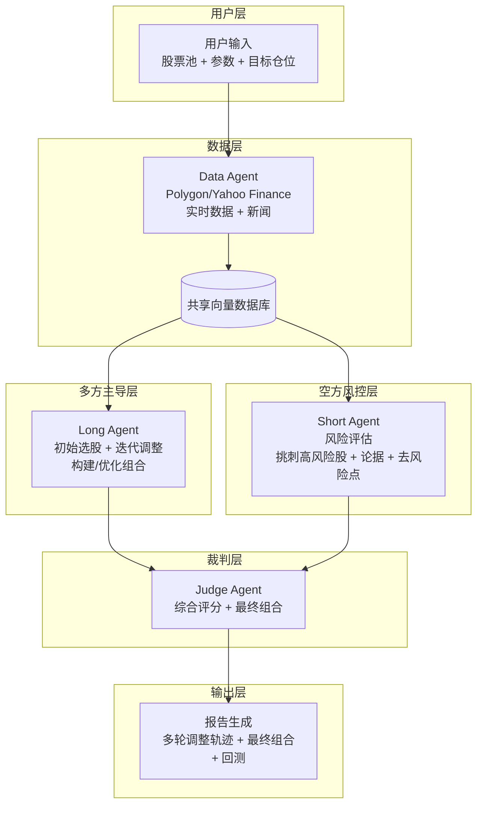

# debate-MAS-基于大语言模型的智能体对抗式投资组合决策系统

### 项目背景

多方（Long Agent） 负责选股并构建初始投资组合；
防御方（Short Agent） 仅作为“魔鬼代言人”，专门从风险角度挑刺（找出高风险股票 + 提供反驳论据 + 指出具体去风险点）；
多方 收到批评后需根据防御方的依据动态调整组合（剔除/减仓/对冲风险股，或许需要或许不需要），进入下一轮迭代。

整个流程变成“提出 → 风险检查 → 调整 → 再检查” 的**迭代优化循环**，最终由裁判给出可执行组合。

核心优势：多方真正掌握主动权，防御方只负责压力测试，避免“防御方也选股”带来的对立拖沓。

**技术支持** 
1，agent对抗式决策
2，langchain，langgraph的流式图结构搭建项目
...

### LANGGRAPH-workflow

**用户输入与初始化（30秒）**

输入：股票池（全市场/板块/自定义列表）、目标仓位数（8-15只）、风险偏好（激进/平衡/保守）、迭代轮次（默认3轮）、最大单股仓位。
系统自动生成 4 个 Agent：Long Agent（主导）、Short Agent（风控挑刺）、Data Agent（数据支撑）、Judge Agent（最终裁决）。

**数据采集阶段（实时）**

Data Agent 调用 Polygon/Yahoo Finance 等接口，拉取最新价格、财务、新闻、期权IV、分析师分歧度等。
全部数据存入共享向量数据库，供所有 Agent 随时检索。

**初始选股（多方主导）**

Long Agent 独立生成初始投资组合（Top 10-15 只股票 + 权重 + 看多理由 + 预期回报）。
输出结构化报告（每只股：**买入逻辑**、目标价、止损位）。
这里的买入逻辑需要再精巧设计

**多轮风险评估循环（核心迭代模块，3轮默认）**

Round 1：Short Agent 接收完整组合，仅针对高风险股票进行评估：
挑选出n只“最危险”股票（高估值、基本面恶化、负面新闻、IV飙升等）。
为每只提供具体反驳论据（引用最新财报/新闻/技术指标）。
明确指出去风险点（例如：“剔除XX，因Q4营收环比下滑18%，建议减仓至0或对冲”）。

**Long Agent 收到挑刺报告后，调整组合：**

决策：剔除/减仓/增加对冲/替换为更安全标的。
给出调整说明（为什么接受/拒绝某条批评）。

**进入下一轮**：

Short Agent继续对调整后的组合风险审批（可重复挑到同一只股，如果风险未消除）。
每轮结束自动记录分数（Judge预打分：风险覆盖度 50%、调整合理性 30%、数据支撑 20%）。

**裁判最终裁决（第3轮结束后）**

Judge Agent 综合3轮迭代结果，输出：
最终多头组合（8-12只股票 + 优化权重 + 净暴露）。
每只股票的风险缓解记录（原风险点 + 已采取措施）。
整体组合指标（预期年化回报、VaR、最大回撤模拟、夏普比率）。
若第3轮仍存在重大分歧，可延长1轮或直接给出“带风险警示版”。

**输出与闭环（以合适的格式输出到某一路径之中）**   

生成完整Markdown/PDF报告：
每轮辩论逐字记录 + 调整轨迹图。
最终组合一键导出（CSV / 交易信号）。
可选历史回测（过去3/6/12个月验证）。
用户反馈 → 下次自动优化 Prompt（例如加强某类风险识别）。


**安全层**
所有输出均标注“仅供参考，非投资建议”。
支持接入真实交易API（需单独授权）。


### 可视化图




### 框架参考图

```text
debate-mas-portfolio/
├── .github/                  # CI/CD 后续可放
│   └── workflows/
├── config/
│   ├── default.yaml          # 主配置（股票池、轮次、模型、温度等）
│   ├── prompts/              # 所有系统提示词（便于版本控制与对比）
│   │   ├── long_initial.j2
│   │   ├── long_adjust.j2
│   │   ├── short_critic.j2
│   │   ├── judge_final.j2
│   │   └── judge_round.j2
│   └── risk_indicators.yaml  # 高风险判断规则（阈值表，可调）
├── data/                     # 本地缓存 / 测试用数据（git ignore 大文件）
│   ├── raw/
│   └── processed/
├── src/
│   ├── agents/
│   │   ├── __init__.py
│   │   ├── base.py           # 公共 Agent 基类（工具绑定、输出解析）
│   │   ├── long.py
│   │   ├── short.py
│   │   ├── data.py
│   │   └── judge.py
│   ├── graph/
│   │   ├── __init__.py
│   │   ├── state.py          # TypedDict / Pydantic State
│   │   ├── nodes.py          # 各个 node 函数
│   │   ├── edges.py          # 条件边逻辑
│   │   └── workflow.py       # 编译 graph 的地方
│   ├── tools/
│   │   ├── __init__.py
│   │   ├── polygon.py
│   │   ├── yfinance_ext.py   # 封装常用查询
│   │   ├── vector_store.py
│   │   └── news.py           # 后续可加新闻爬取/embedding
│   ├── report/
│   │   ├── __init__.py
│   │   ├── templates/        # jinja2 模板
│   │   └── generator.py
│   ├── backtest/
│   │   └── core.py
│   ├── utils/
│   │   ├── logging.py
│   │   ├── config.py
│   │   ├── typing.py         # 常用类型别名
│   │   └── viz.py            # 权重变化图、雷达图等
│   └── cli/
│       └── main.py           # typer / click 入口
├── tests/
│   ├── unit/
│   ├── integration/
│   └── mock_data/
├── scripts/
│   ├── run_demo.py           # 快速跑一个案例
│   ├── run_backtest.py
│   └── visualize_graph.py    # 输出 mermaid / png
├── docs/
│   ├── architecture.md
│   ├── prompts.md            # 所有提示词说明 + 变更记录
│   └── examples/             # 好/坏案例截图或 md
├── .gitignore
├── Dockerfile
├── pyproject.toml            # 或 requirements.txt + setup.py
├── README.md
├── ROADMAP.md
└── LICENSE                   # MIT / Apache 2.0 建议
```
